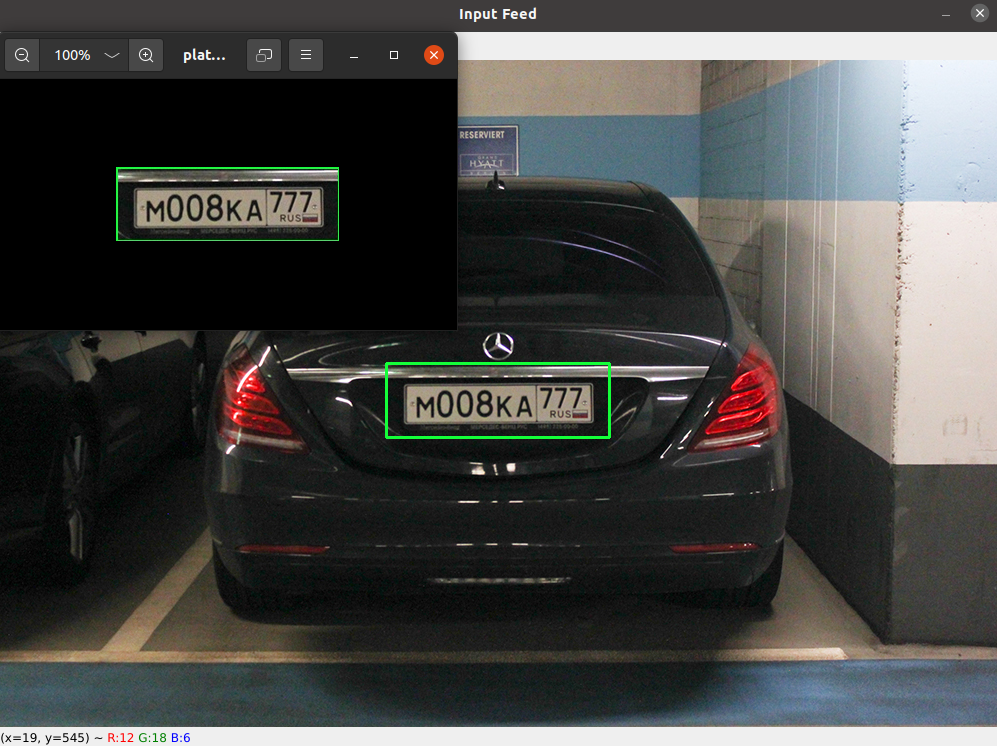

## OpenCV
Introduction to **Computer Vision**.
All credit goes to an amazing [Murtaza's Worshop](https://www.instagram.com/murtazasworkshop/). He's the man behind the lessons. 
#
 - ### Project 1
    - ##### Paint
    
    
    
   #
 - ### Project 2
    - ##### Document Scanner
    
   #
 - ### Project 3
    - ##### Plate Number Detector
    
    *Russia only*
   #
 #### OpenCV Intro
   - ##### Chapter 1
           Read images, video and webcam feed.
   - ##### Chapter 2
           Basic Functions
   - ##### Chapter 3
           Resizing and Cropping
   - ##### Chapter 4
           Shapes and text
   - ##### Chapter 5
           Warp Perspective
   - ##### Chapter 6
           Joining images
   - ##### Chapter 7
           Color detection
   - ##### Chapter 8
           Contours and shape detection
   - ##### Chapter 9
           Face detection
#
You may grab some [Free Stock Videos](https://www.pexels.com/videos/) for your projects.  
You can get *Haar Cascades* for **OpenCV** [here](https://github.com/opencv/opencv/tree/master/data/haarcascades) 
